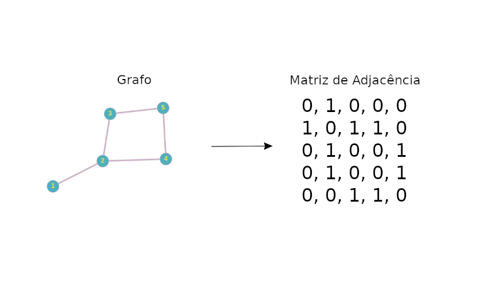
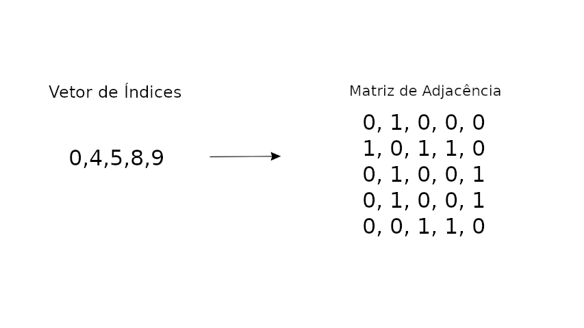
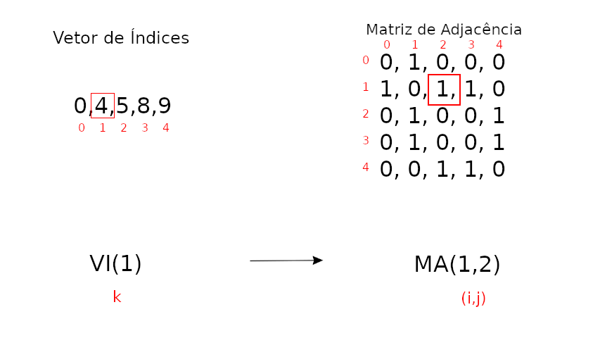

# Análise e Projeto de Algoritmo

## Primeiro Trabalho Implementação – APA

1 – Gerar randomicamente um grafo não orientado com 100 vértices , com um número baixo
de ligações ( de uma a dez vezes o número de vértices ).

2 – Implementar um algoritmo que gere a representação matricial ( matriz adjacência binária )

```
int **RandomGraph::generateAdjMatrix(int n)
{
    int **matrix = new int *[n];
    for (int i = 0; i < n; i++)
    {
        matrix[i] = new int[n]();
    }

    int m = this->numEdges;

    while (m > 0)
    {

        RandomNumber generator;

        int i = generator.random(0, n - 1);
        int j = generator.random(0, n - 1);

        if (i != j && matrix[i][j] == 0)
        {
            matrix[i][j] = 1;
            matrix[j][i] = 1;
            m--;
        }
    }

    return matrix;
}
```

Complexidade:

- **Melhor Caso**: *O(m)*, onde todas as arestas são inseridas rapidamente sem muitas rejeições.
- **Pior Caso**: *O(m×n²)*, onde encontrar uma aresta válida se torna cada vez mais difícil devido à densidade da matriz.



3 – Implementar um algoritmo que, a partir da matriz, gere a representação vetorial ( vetor
binário )de sua parte triangular superior.

```
int *RandomGraph::generateVectorFromAdjMatrix(int **matrix)
{
    int size = (this->numVertices * (this->numVertices - 1)) / 2;

    int *binaryVector = new int[size];

    int k = 0;

    for (int i = 0; i < this->numVertices - 1; i++)
    {
        for (int j = i + 1; j < this->numVertices; j++)
        {
            binaryVector[k] = matrix[i][j];
            k++;
        }
    }

    return binaryVector;
}
```
Complexidade:

- *O(n²)*, o algoritmo percorre o triângulo superior da matriz de adjacência, o que envolve $n*(n - 1)/2$ iterações no total


4 – Gerar o vetor compactado ( vetor de índices inteiros ) com endereçamento indireto.

```
int *RandomGraph::generateIndexVectorFromVector(int *vector)
{
    int sizeIndex = this->numEdges;
    int *indexVector = new int[sizeIndex];

    int size = (this->numVertices * (this->numVertices - 1)) / 2;

    int k = 0;
    for (int i = 0; i < size; i++)
    {
        if (vector[i] == 1)
        {
            indexVector[k] = i;
            k++;
        }
    }

    return indexVector;
}
```

Complexidade:

- *O(n²)*: O algoritmo percorre todos os *O(n²)* elementos do vetor vector, realizando uma comparação e, possivelmente, uma atribuição de índice. Como o número de elementos cresce quadraticamente com o número de vértices no grafo, a complexidade do algoritmo também é quadrática.


5 – Implementar um algoritmo que a partir do vetor compactado gere a matriz de adjacência.

```
int **RandomGraph::generateAdjMatrixFromIndexVector(int *indexVector)
{
    int **matrix = new int *[this->numVertices];
    for (int i = 0; i < this->numVertices; i++)
    {
        matrix[i] = new int[this->numVertices]();
    }

    OperatorMatrix operatorMatrix;

    for (int a = 0; a <= this->numEdges - 1; a++)
    {
        int k = indexVector[a];

        pair<int,int> p = operatorMatrix.convertToPair(k, this->numVertices);

        matrix[p.first][p.second] = 1;
        matrix[p.second][p.first] = 1;
    }

    return matrix;
}
```

Complexidade:

- **Melhor Caso**: *O(m)*, no caso de um grafo esparso, com poucas arestas, a complexidade será menor, proporcional a *O(n)*
- **Pior Caso**: *O(n²)*, para um grafo completo



6 – Implementar a função de mapeamento que a partir da entrada (i,j) da matriz de adjacência
de ordem n acesse a posição k do vetor de índices. Implementar o cálculo analítico (
progressão aritmética ) e também os procedimentos iterativo e recursivo.

Cálculo Analítico:
```
int OperatorMatrix::convertToIndex(int i, int j, int n)
{
    int index = 0;

    if (i < j)
    {
        index = (i * (2 * n - i - 1)) / 2 + (j - i - 1);
    }
    else
    {
        index = (j * (2 * n - j - 1)) / 2 + (i - j - 1);
    }

    return index;
}
```

Complexidade:
- *O(1)*: possui complexidade constante

Procedimento Iterativo:
```
int OperatorMatrix::convertToIndexItr(int i, int j, int n)
{
    if( i==j) return -1;
    
    if (i > j) 
    {
        int tmp = i;
        i = j;
        j = tmp;
    }

    int index = 0;

    for (int k = 0; k < i; k++)
    {
        index += n - k - 1;
    }

    return index + (j - i - 1);
}
```

Complexidade:

- **Pior Caso**: *O(n)*, itera *n-1* vezes no pior caso

Procedimento Recursivo:
```
int OperatorMatrix::sumIndex(int i, int n)
{
    if(i == 0) return 0;

    return n - i + this->sumIndex(i - 1, n);
}

int OperatorMatrix::convertToIndexRec(int i, int j, int n)
{
    if( i==j) return -1;
    
    if (i > j) 
    {
        int tmp = i;
        i = j;
        j = tmp;
    }

    return this->sumIndex(i, n) + (j - i - 1);
}
```
Complexidade:

- **Pior Caso**: *O(n)*, a recurssão é chamada *n* vezes


7 – Implementar a função de mapeamento inversa que a partir do índice k do vetor acesse a
posição (i,j) da matriz de adjacência de ordem n. Implementar o cálculo analítico ( algoritmo
raiz quadrada ) e também o procedimento iterativo.

Cálculo Analítico:
```
std::pair<int, int> OperatorMatrix::convertToPair(int k, int n)
{
    int row = floor((2*n - 1 - sqrt((2*n - 1)*(2*n - 1) - 8*k))/2);
    int soma = (row*(2*n - row - 1))/2;

    int col = k - soma + row + 1;
    
    return make_pair(row, col);
}
```

Complexidade:

- **Pior Caso**: *O(1)*, a complexidade é constante


Procedimento Iterativo:
```
std::pair<int, int> OperatorMatrix::convertToPairPA(int k, int n)
{
    int sum = 0;
    int row = 0;
    while (sum <= k)
    {
        sum += n - row - 1;
        row++;
    }
    row--;

    int col = k - row * n + row * (row + 1) / 2 + row + 1;

    return make_pair(row, col);
}
```

Complexidade:
- **Pior Caso**: *O(n)*, o número de iterações do loop cresce aproximadamente como *O($\sqrt{k}$)*. Como k se aproxima de n² no pior caso e $\sqrt{k} = \sqrt{n²} = n$, utilizamos a função quadrática como aproximação da soma da progressão aritmética. 



8 – Implementar as operações de soma ( operação de união ) , produto direto ( operação de
interseção ) entre duas matrizes utilizando suas respectivas representações vetoriais.

Operação de Soma:
```
int *OperatorMatrix::sum(int *vetor1, int *vetor2, int n)
{
    int tam = (n * (n - 1))/2;

    int *result = new int[tam];
    

    for (int i = 0; i < tam; i++)
    {
        result[i] = vetor1[i] + vetor2[i];
    }
    
    return result;
}
```

Complexidade:

- *O(n²)*: o loop itera $n * (n -1)/2$ vezes, o que se aproxima da função quadrática

Operação de Multiplicação:
```
int **OperatorMatrix::multiply(int *vetor1, int *vetor2, int n)
{
    int **matrix = new int *[n];
    for (int i = 0; i < n; i++)
    {
        matrix[i] = new int[n]();
    }

    for (int i = 0; i < n; i++)
    {
        for(int j = 0; j < n; j++)
        {
            int temp = 0;
            for(int x = 0; x < n; x++)
            {
                int a = 0;
                int b = 0;

                if(x > i){
                    int k = this->convertToIndex(i, x, n);
                    a = vetor1[k];
                }
                else if(x < i){
                    int k = this->convertToIndex(x, i, n);
                    a = vetor1[k];
                }

                if(j > x){
                    int k = this->convertToIndex(x, j, n);
                    b = vetor2[k];
                }
                else if(j < x){
                    int k = this->convertToIndex(j, x, n);
                    b = vetor2[k];
                }

                temp += a * b;
            }
            matrix[i][j] = temp;
            temp = 0;
        }
    }

    return matrix;
}
```

Complexidade:

- *O(n³)*, as 3 iterações aninhadas, cada uma com n iterações, resultam em n³ iterações 

Obs.: Todos os algoritmos devem ser testados bem como determinado as suas funções de
complexidade.

## Execução

Clonar o repositório:

```
git clone git@github.com:gabrielfsil/analise-e-projeto-de-algoritmo.git
```

Acessar a pasta do projeto:

```
cd analise-e-projeto-de-algoritmo
```

Para compilar o projeto basta executar o comando na pasta raiz do projeto

```
make
```

E para executar:

```
./bin/main
```