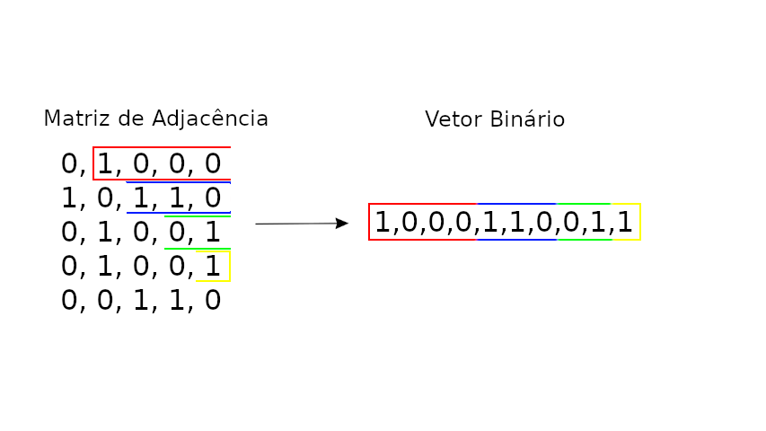

# Análise e Projeto de Algoritmo

## Primeiro Trabalho Implementação – APA

1 – Gerar randomicamente um grafo não orientado com 100 vértices , com um número baixo
de ligações ( de uma a dez vezes o número de vértices ).

2 – Implementar um algoritmo que gere a representação matricial ( matriz adjacência binária )


3 – Implementar um algoritmo que, a partir da matriz, gere a representação vetorial ( vetor
binário )de sua parte triangular superior.



4 – Gerar o vetor compactado ( vetor de índices inteiros ) com endereçamento indireto.


5 – Implementar um algoritmo que a partir do vetor compactado gere a matriz de adjacência.


6 – Implementar a função de mapeamento que a partir da entrada (i,j) da matriz de adjacência
de ordem n acesse a posição k do vetor de índices. Implementar o cálculo analítico (
progressão aritmética ) e também os procedimentos iterativo e recursivo.


7 – Implementar a função de mapeamento inversa que a partir do índice k do vetor acesse a
posição (i,j) da matriz de adjacência de ordem n. Implementar o cálculo analítico ( algoritmo
raiz quadrada ) e também o procedimento iterativo.


8 – Implementar as operações de soma ( operação de união ) , produto direto ( operação de
interseção ) entre duas matrizes utilizando suas respectivas representações vetoriais.

Obs.: Todos os algoritmos devem ser testados bem como determinado as suas funções de
complexidade.

## Execução

Clonar o repositório:

```
git clone git@github.com:gabrielfsil/analise-e-projeto-de-algoritmo.git
```

Acessar a pasta do projeto:

```
cd analise-e-projeto-de-algoritmo
```

Para compilar o projeto basta executar o comando na pasta raiz do projeto

```
make
```

E para executar:

```
./bin/main
```